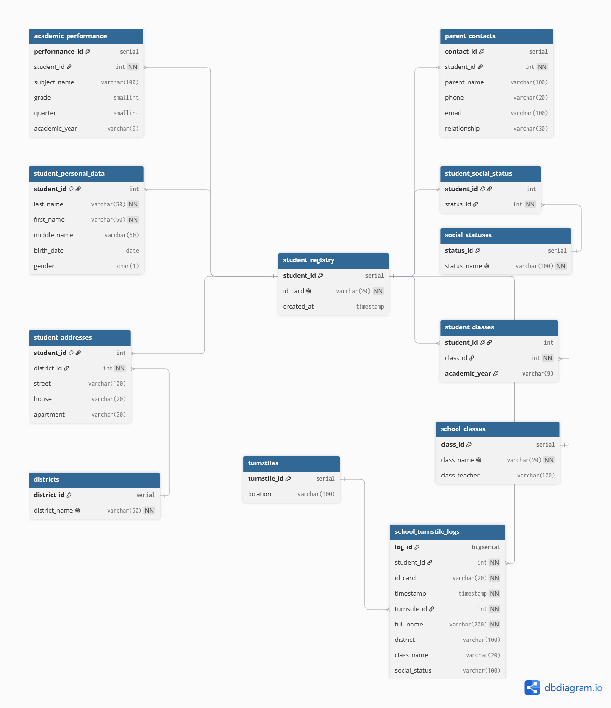

# 🎓 School Access Database

## 👨‍💻 Автор

* **WhosArt** — разработка архитектуры базы данных, проектирование схемы, реализация SQL-скриптов и документации.

## 📖 Описание проекта

Проект представляет собой реляционную базу данных для учёта школьников и регистрации проходов через турникеты. База данных спроектирована в PostgreSQL с использованием принципов нормализации и денормализации данных.

## 🗺️ ER-диаграмма

🔗 Интерактивная версия: https://dbdiagram.io/d/...

### ✨ Основные возможности системы

* хранение данных об учащихся;
* хранение адресной информации;
* учёт контактов родителей;
* хранение социальных статусов семей;
* учёт принадлежности учеников к классам;
* хранение информации об успеваемости;
* регистрация проходов через турникеты;
* анонимизация журнала проходов с помощью VIEW.

## 🛠 Используемые технологии

* PostgreSQL
* DBML (dbdiagram.io)
* Git
* GitHub

## 📂 Структура проекта

* `schema.dbml` — схема базы данных в формате DBML;
* `create_tables.sql` — SQL-скрипт создания таблиц и внешних ключей;
* `views.sql` — создание представлений (VIEW);
* `sample_data.sql` — примеры тестовых данных.

## 🗂 Структура базы данных

Центральной таблицей является `student_registry`, содержащая уникальный идентификатор `student_id`.

Остальные таблицы связаны с ней посредством внешних ключей:

* `student_personal_data`
* `student_addresses`
* `districts`
* `parent_contacts`
* `social_statuses`
* `student_social_status`
* `school_classes`
* `student_classes`
* `academic_performance`
* `turnstiles`
* `school_turnstile_logs`

## 🚪 Журнал проходов

Таблица `school_turnstile_logs` хранит события прохода через турникеты и содержит:

### ⚙️ Технические атрибуты

* `id_card`
* `timestamp`
* `turnstile_id`

### 📝 Денормализованные атрибуты

* `full_name`
* `district`
* `class_name`
* `social_status`

## Анонимизация данных

Для ограничения доступа к персональным данным создано представление:

`v_turnstile_logs_anonymized`

Во VIEW отображаются только технические данные и `student_id`, без ФИО и других текстовых атрибутов.

## 🚀 Запуск проекта

1. Создать базу данных PostgreSQL.
2. Выполнить скрипт `create_tables.sql`.
3. При необходимости загрузить тестовые данные из `sample_data.sql`.
4. Выполнить скрипт `views.sql`.
